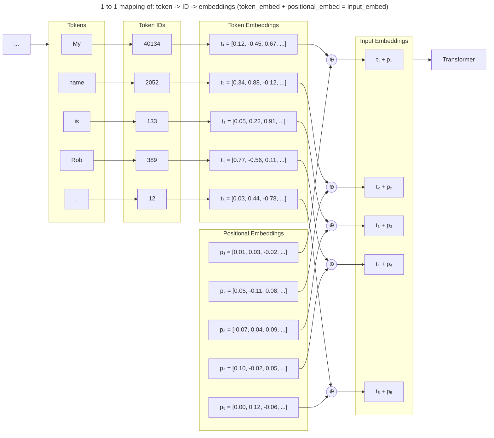

# horrible-tokens
#include "Tokens.def"


```cpp
enum class Tokens: unsigned short {
#define TOKEN(X) X,
#include "horribletokens/Tokens.def"
  NUM_TOKENS
};
```



```mermaid
---
title: "1 to 1 mapping of: token -> ID -> embeddings (token_embed + positional_embed = input_embed)"
---

flowchart LR
    subgraph inputtexts["Tokens"]
        direction TB
        txt1["My"]
        txt2["name"]
        txt3["is"]
        txt4["Rob"]
        txt5["."]
    end

    subgraph tokenids["Token IDs"]
        direction TB
        id1["40134"]
        id2["2052"]
        id3["133"]
        id4["389"]
        id5["12"]
    end

    subgraph tokenembeddings["Token Embeddings"]
        direction TB
        e1["t₁ = [0.12, -0.45, 0.67, ...]"]
        e2["t₂ = [0.34, 0.88, -0.12, ...]"]
        e3["t₃ = [0.05, 0.22, 0.91, ...]"]
        e4["t₄ = [0.77, -0.56, 0.11, ...]"]
        e5["t₅ = [0.03, 0.44, -0.78, ...]"]
    end

    subgraph posembeddings["Positional Embeddings"]
        direction TB
        p1["p₁ = [0.01, 0.03, -0.02, ...]"]
        p2["p₂ = [0.05, -0.11, 0.08, ...]"]
        p3["p₃ = [-0.07, 0.04, 0.09, ...]"]
        p4["p₄ = [0.10, -0.02, 0.05, ...]"]
        p5["p₅ = [0.00, 0.12, -0.06, ...]"]
    end

    subgraph inputembeddings["Input Embeddings"]
        direction TB
        i1["t₁ + p₁"]
        i2["t₂ + p₂"]
        i3["t₃ + p₃"]
        i4["t₄ + p₄"]
        i5["t₅ + p₅"]
    end

    %% Addition nodes
    add1(("⊕"))
    add2(("⊕"))
    add3(("⊕"))
    add4(("⊕"))
    add5(("⊕"))

    %% Flows
    txt1 --> id1 --> e1 --> add1 --> i1
    txt2 --> id2 --> e2 --> add2 --> i2
    txt3 --> id3 --> e3 --> add3 --> i3
    txt4 --> id4 --> e4 --> add4 --> i4
    txt5 --> id5 --> e5 --> add5 --> i5

    p1 --> add1
    p2 --> add2
    p3 --> add3
    p4 --> add4
    p5 --> add5

    input["..."] --> inputtexts
    inputembeddings --> transformer["Transformer"]
```

